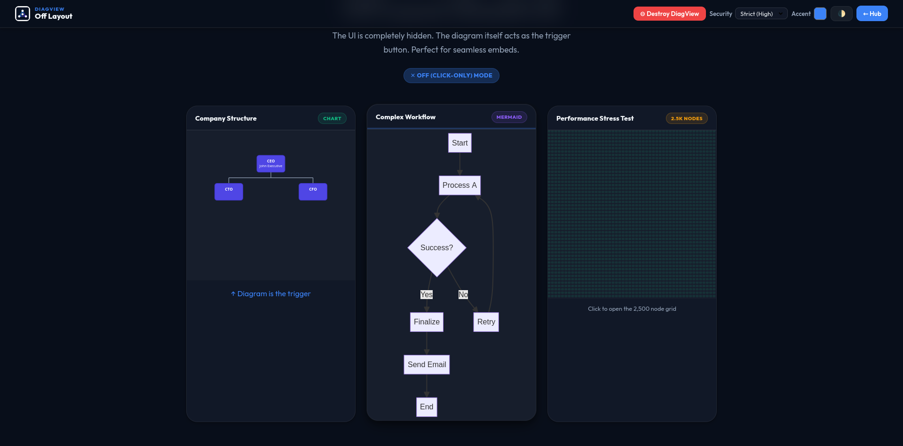

# DiagView

> A lightweight, framework-agnostic interactive viewer for SVG diagrams.  
> Adds Zoom · Pan · Search · Export · Minimap · Rotation · Presentation Mode to any SVG on your page.

[](https://www.npmjs.com/package/diagview)
[](https://bundlephobia.com/package/diagview)
[](https://opensource.org/licenses/MIT)
[](https://github.com/khadirullah/diagview/actions)


> **[Live Demo →](https://khadirullah.github.io/diagview/)**

---

## Table of Contents

- [Features](#-features)
- [Installation](#-installation)
- [Quick Start](#-quick-start)
- [Layout Modes](#-layout-modes)
- [Per-Diagram Overrides](#-per-diagram-overrides)
- [Keyboard Shortcuts](#-keyboard-shortcuts)
- [Export Formats](#-export-formats)
- [Framework Integration](#-framework-integration)
- [Configuration](#-configuration)
- [Screenshots](#-screenshots)
- [Live Demo](#-live-demo)
- [Documentation](#-documentation)
- [Contributing](#-contributing)
- [License](#-license)

---

## ✨ Features

| Feature                      | Description                                                            |
| ---------------------------- | ---------------------------------------------------------------------- |
| 🎨 **Auto-Theming**          | Detects Tailwind, Bootstrap, and system dark/light mode automatically  |
| 🔍 **Node Search**           | Instant search with pulsing glow highlights on matching nodes          |
| 📤 **Multi-Format Export**   | PNG, SVG, PDF, JPEG, WebP — with transparent background option         |
| 📋 **Clipboard Copy**        | Copy diagrams directly to the clipboard                                |
| ⌨️ **Keyboard Shortcuts**    | Full keyboard navigation (zoom, pan, search, share, rotate)            |
| 📱 **Mobile Optimized**      | Pinch-to-zoom, double-tap to reset, Visual Viewport sync for stability |
| 🗺️ **Smart Minimap**         | Accurate portrait/landscape scaling; click-to-navigate                 |
| 🎯 **Meeting Mode**          | Laser pointer that follows the cursor for presentations                |
| 🔗 **Precision Share Links** | Share exact zoom/pan position via URL parameters                       |
| 🔄 **Rotation**              | 90° rotation steps with correct Panzoom recalibration                  |
| 📝 **Text Select Mode**      | Toggle SVG text selection for copying node labels                      |
| 🔒 **SVG Sanitization**      | Three-tier security model (strict/permissive/off)                      |
| 🎭 **3 Layout Modes**        | Header toolbar, floating FAB, or invisible click-to-open               |
| 🔧 **Per-Diagram Overrides** | Set layout, accent, scale per diagram via `data-*` attributes          |
| 🌐 **Shadow DOM Support**    | Works inside Shadow DOM roots                                          |
| 🔄 **Remember Zoom**         | Persist zoom/pan state per diagram across modal opens (session)        |
| 📦 **Minimal Dependencies**  | Only requires @panzoom/panzoom core module                             |
| 🚫 **Framework Agnostic**    | Works with React, Vue, Svelte, Angular, or plain HTML                  |
| 🏷️ **Silent Branding**       | Invisible in UI; professional attribution added during export          |

---

## 📦 Installation

### CDN (Recommended for quick start)

```html
<!-- 1. Required: Panzoom for zoom/pan physics -->
<script src="https://cdn.jsdelivr.net/npm/@panzoom/panzoom@4.5.1/dist/panzoom.min.js"></script>

<!-- 2. DiagView (latest stable) -->
<script src="https://cdn.jsdelivr.net/npm/diagview@1.0.6/dist/diagview.umd.min.js"></script>
<!-- For auto-updates within v1: diagview@1.0.6 -->
```

To disable auto-initialization and configure manually:

```html
<script
  src="https://cdn.jsdelivr.net/npm/diagview@1.0.6/dist/diagview.umd.min.js"
  data-diagview-no-auto-init
></script>
<script>
  DiagView.init({ layout: "floating", accentColor: "#3b82f6" });
</script>
```

### NPM

```bash
npm install diagview @panzoom/panzoom
```

```javascript
import DiagView from "diagview";

DiagView.init({ layout: "floating" });
```

### ESM (Bundlers / Vite / Webpack)

```javascript
import DiagView from "diagview"; // resolves dist/esm/index.js
```

---

## 🚀 Quick Start

### Step 1 — Wrap your SVG

DiagView matches any element that contains an `<svg>` tag. By default it targets `.diagram`, `.chart`, and `[data-diagram]`:

```html
<div class="diagram" data-title="System Overview">
  <svg xmlns="http://www.w3.org/2000/svg" viewBox="0 0 800 600">
    <!-- your SVG content -->
  </svg>
</div>
```

### Step 2 — Initialize

```javascript
DiagView.init({
  layout: "floating", // 'header' | 'floating' | 'off'
  accentColor: "#3b82f6", // optional brand color
  highResScale: 4, // export resolution (1–10)
  showKeyboardHelp: true, // show shortcuts on first open
});
```

### Step 3 — Done 🎉

DiagView automatically:

- Wraps each matching diagram with interactive controls
- Adds copy, download, and fullscreen buttons
- Enables zoom, pan, and search in fullscreen mode
- Handles keyboard shortcuts, theme sync, and mobile touch

---

## 🎨 Layout Modes

### Floating (Default)

A circular FAB button appears at the bottom-right of the fullscreen viewer. Controls on the diagram card hover in at the bottom. Ideal for clean, minimal UIs.

```javascript
DiagView.init({ layout: "floating" });
```

### Header

A full-width toolbar is always visible above the diagram. Best for documentation sites and dashboards where discoverability matters.

```javascript
DiagView.init({ layout: "header" });
```

### Off (Click-to-open)

No controls are rendered on the diagram card. The diagram itself is the trigger — clicking it opens the fullscreen viewer. Perfect for tight layouts and embeds.

```javascript
DiagView.init({ layout: "off" });
```

---

## 🎛️ Per-Diagram Overrides

Any diagram can override the global configuration using `data-diagview-*` attributes. This lets you mix layout modes and accent colors on a single page.

```html
<!-- Use header layout with a purple accent for this diagram only -->
<div
  class="diagram"
  data-diagview-layout="header"
  data-diagview-accent="#8b5cf6"
  data-diagview-scale="6"
  data-title="My Architecture"
>
  <svg>...</svg>
</div>

<!-- This diagram uses the global defaults -->
<div class="diagram">
  <svg>...</svg>
</div>
```

| Attribute                         | Values                              | Description                             |
| --------------------------------- | ----------------------------------- | --------------------------------------- |
| `data-diagview-layout`            | `header` \| `floating` \| `off`     | Layout for this diagram only            |
| `data-diagview-accent`            | Any CSS color                       | Accent color for this diagram only      |
| `data-diagview-scale`             | `1`–`10`                            | Export resolution for this diagram only |
| `data-diagview-sanitize`          | `strict` \| `permissive` \| `off`   | SVG sanitization mode                   |
| `data-diagview-allow-remote`      | `true` \| `false`                   | Allow remote CSS/fonts in SVG           |
| `data-diagview-watermark`         | `true` \| `false`                   | Enable branding for this diagram only   |
| `data-diagview-watermark-text`    | Any string                          | Custom brand text (e.g. your name)      |
| `data-diagview-watermark-style`   | `corner` \| `background` \| `both`  | Style override for this diagram         |
| `data-diagview-watermark-pos`     | `top-left` \| `...` \| `four-sides` | Position override for this diagram      |
| `data-diagview-watermark-opacity` | `0.1`–`1.0`                         | Transparency override for this diagram  |
| `data-title`                      | Any string                          | Title shown in header layout label      |

> **Security note:** `data-diagview-sanitize="off"` and `data-diagview-allow-remote="true"` only work when `security.allowOverrides` is `true` in the global config (the default). Use these only with SVGs from fully trusted sources.

---

## ⌨️ Keyboard Shortcuts

All shortcuts are active when the fullscreen modal is open.

| Key              | Action                                          |
| ---------------- | ----------------------------------------------- |
| `Esc`            | Close fullscreen (or close keyboard help first) |
| `Space` / `0`    | Reset zoom — fit diagram to screen              |
| `+` / `=`        | Zoom in                                         |
| `-` / `_`        | Zoom out                                        |
| `↑` `↓` `←` `→`  | Pan diagram                                     |
| `Shift` + `↑↓←→` | Fast pan (3× speed)                             |
| `F`              | Focus search input                              |
| `T`              | Toggle text-select mode (copy SVG labels)       |
| `R`              | Rotate 90° clockwise                            |
| `M`              | Toggle meeting mode (laser pointer)             |
| `L`              | Copy share link to clipboard                    |
| `?`              | Show/hide keyboard shortcuts panel              |

---

## 📤 Export Formats

| Format | Transparent | Notes                                 |
| ------ | ----------- | ------------------------------------- |
| PNG    | ✅          | High-res raster; default 4× scale     |
| SVG    | ✅          | Fully scalable vector                 |
| JPEG   | ❌          | Smallest file size                    |
| WebP   | ✅          | Modern format; good compression       |
| PDF    | ❌          | Requires jsPDF (lazy-loaded from CDN) |
| Copy   | ❌          | Copies PNG to system clipboard        |

### Programmatic export

```javascript
const el = document.querySelector(".diagram");

// Format shortcuts
await DiagView.exportToPNG(el, { transparent: true });
await DiagView.exportToSVG(el);
await DiagView.exportToJPEG(el, { filename: "my-diagram" });
await DiagView.exportToWebP(el, { transparent: true });
await DiagView.exportToPDF(el);
await DiagView.copyToClipboard(el);

// Generic dispatcher (used internally by the UI)
await DiagView.exportDiagram(el, "png", { transparent: true });
```

---

## 🌐 Framework Integration

### React

```jsx
import { useEffect } from "react";
import DiagView from "diagview";

export default function App() {
  useEffect(() => {
    DiagView.init({ layout: "floating" });
    return () => {
      DiagView.destroy();
    };
  }, []);

  return (
    <div className="diagram">
      <svg viewBox="0 0 400 300">{/* ... */}</svg>
    </div>
  );
}
```

### Vue 3

```vue
<script setup>
import { onMounted, onUnmounted } from "vue";
import DiagView from "diagview";

onMounted(() => DiagView.init({ layout: "floating" }));
onUnmounted(() => DiagView.destroy());
</script>

<template>
  <div class="diagram">
    <svg viewBox="0 0 400 300"><!-- ... --></svg>
  </div>
</template>
```

### Svelte

```svelte
<script>
  import { onMount, onDestroy } from 'svelte';
  import DiagView from 'diagview';

  onMount(() => DiagView.init({ layout: 'floating' }));
  onDestroy(() => DiagView.destroy());
</script>

<div class="diagram">
  <svg viewBox="0 0 400 300"><!-- ... --></svg>
</div>
```

### Shadow DOM

```javascript
const shadow = myElement.attachShadow({ mode: "open" });
// ... render content into shadow root ...

DiagView.init(); // init normally first
DiagView.initShadowRoot(shadow); // then scan the shadow root
```

### Mermaid.js

Always render Mermaid first, then initialize DiagView:

```javascript
await mermaid.run();
DiagView.init({ diagramSelector: ".mermaid" });
```

---

## ⚙️ Configuration

Full configuration reference:

```javascript
DiagView.init({
  // ── Selectors ────────────────────────────────────
  diagramSelector: ".diagram, .chart, [data-diagram]",

  // ── Theme ────────────────────────────────────────
  accentColor: null, // null = auto-detect from CSS vars / OS
  backgroundColor: null, // null = auto-detect
  textColor: null, // null = auto-detect

  // ── Layout ───────────────────────────────────────
  layout: "floating", // 'header' | 'floating' | 'off'

  // ── UI ───────────────────────────────────────────
  ui: {
    buttons: {
      style: "accent", // 'transparent' | 'accent' | 'solid' | 'neutral'
      icons: {
        copy: null, // null = built-in icon, or pass an SVG string
        download: null,
        fullscreen: null,
      },
    },
  },
  showBranding: true, // Show DiagView branding link
  showKeyboardHelp: true, // Show shortcut panel on first open
  helpTimeout: 8000, // ms before shortcut panel auto-closes (0 = never)
  animateOpen: true, // CSS scale animation when opening fullscreen

  // ── Interaction ──────────────────────────────────
  naturalPanning: false, // true = scroll-like pan direction
  immersiveMode: false, // true = lock viewport meta on mobile open
  rememberZoom: false, // true = restore zoom/pan across modal opens (session)
  showMinimap: true, // Show minimap when diagram overflows viewport
  printFriendly: true, // Hide controls in print media

  // ── Zoom / Pan ───────────────────────────────────
  maxZoomScale: 25, // Upper zoom limit (1–50)
  minZoomScale: 0.05, // Lower zoom limit (0.01–1)
  zoomAnimationDuration: 200, // ms
  panAnimationDuration: 200, // ms

  // ── Export ───────────────────────────────────────
  highResScale: 4, // Desktop export multiplier (1–10)
  mobileScale: 2, // Mobile export multiplier (1–5)
  maxPixels: 16777216, // Safety cap (default 16MP = 4096×4096)

  // ── Security ─────────────────────────────────────
  security: {
    mode: "strict", // 'strict' | 'permissive' | 'off'
    allowOverrides: true, // Allow data-diagview-sanitize per element
    allowRemoteResources: false, // Allow @import / url() to external URLs
  },
  allowedImageTypes: ["png", "jpeg", "webp", "gif"],

  // ── Performance ──────────────────────────────────
  performance: {
    largeFileThreshold: 1000000, // 1 MB — skip style baking above this
    criticalFileLimit: 50000000, // 50 MB — hard block above this
  },

  // ── Notifications ────────────────────────────────
  toastDuration: 2500, // Success toast duration (ms)
  errorToastDuration: 5000, // Error toast duration (ms)

  // ── PDF ──────────────────────────────────────────
  pdfLibraryUrl: "https://cdnjs.cloudflare.com/ajax/libs/jspdf/2.5.1/jspdf.umd.min.js",
  // pdfLibraryIntegrity is auto-set when using the default URL above.
  // Set to null if you provide a custom pdfLibraryUrl.

  // ── Callbacks ────────────────────────────────────
  onOpen: null, // () => void — modal opened
  onClose: null, // () => void — modal closed
  onExport: null, // (format, filename) => void — export complete
  onZoomChange: null, // (scale) => void — zoom level changed
  onError: null, // (error) => void — SVG validation failed

  // ── Watermark (Silent Branding) ──────────────────
  watermark: {
    enabled: false, // true = inject branding on export/download
    text: "", // The text to display (e.g. "yourdomain.com")
    style: "corner", // 'corner' | 'background' | 'both'
    position: "bottom-right", // 'top-left' | 'top-right' | 'bottom-left' | 'bottom-right' | 'four-sides'
    opacity: 0.2, // 0.1 - 1.0 (default 0.2)
  },
});
```

## 🚀 Live Demo

Experience all features including Search, Export, and Meeting Mode in our interactive playground:

**[Explore the Live Demo →](https://khadirullah.github.io/diagview/)**

---

## 📸 Screenshots

### Fullscreen Viewer

The heart of DiagView. A dedicated, distraction-free environment for deep diagram analysis with integrated tools.


### Smart Minimap

Real-time navigation with accurate portrait/landscape scaling. Click anywhere to jump to that part of the diagram.


### Mobile Optimized

A first-class mobile experience with pinch-to-zoom, double-tap to reset, and visual viewport stability.


### Flexible Layouts

Choose the layout that fits your site: **Floating HUD**, **Header Controls**, or **Minimalist (Off)**.

<p align="center">
  
  
  
</p>

---

## 📚 Documentation

| Document                                             | Description                             |
| ---------------------------------------------------- | --------------------------------------- |
| [Live Demo](https://khadirullah.github.io/diagview/) | **Interactive online playground**       |
| docs/USAGE.md                                        | Complete usage guide (basic → advanced) |
| docs/API.md                                          | Full public API reference               |
| docs/FAQ.md                                          | Frequently asked questions              |
| BUILD.md                                             | Local development & build instructions  |
| CONTRIBUTING.md                                      | How to contribute                       |
| SECURITY.md                                          | Security policy                         |
| CHANGELOG.md                                         | Version history                         |

---

## 🤝 Contributing

Contributions are welcome! See CONTRIBUTING.md for guidelines.

```bash
git clone https://github.com/khadirullah/diagview.git
cd diagview
npm install
npm run dev     # watch mode
npm test        # run unit tests
```

---

## 📝 License

MIT © [Khadirullah Mohammad](https://github.com/khadirullah)

---

## 🙏 Credits

- [Panzoom](https://github.com/timmywil/panzoom) — zoom/pan physics
- [jsPDF](https://github.com/parallax/jsPDF) — PDF export (lazy-loaded)
- [Lucide Icons](https://lucide.dev) — icon design inspiration

---

## 🤖 Authenticity Statement

This library was conceptually designed and architected by the author to solve real-world SVG documentation needs. Implementation was produced with AI assistance under strict human supervision and code review.
