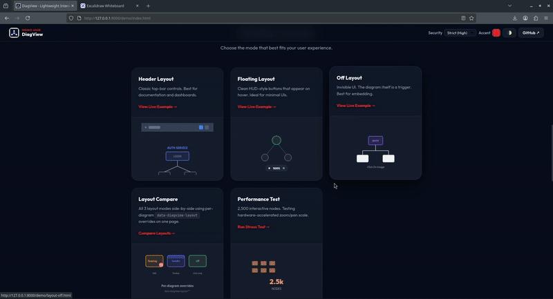
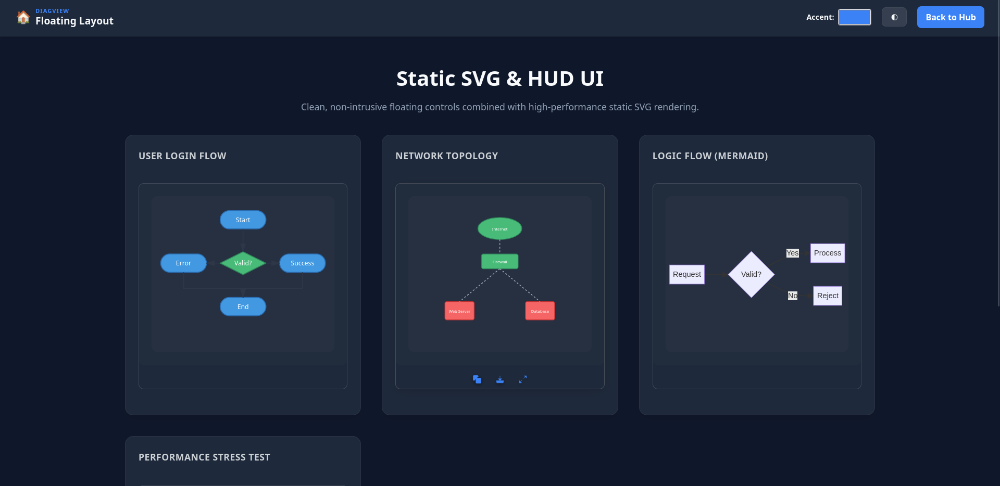
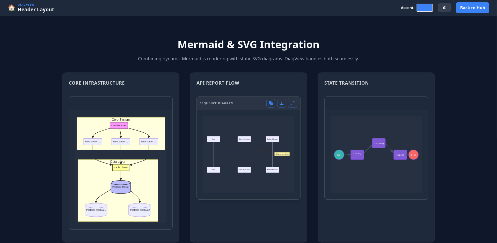
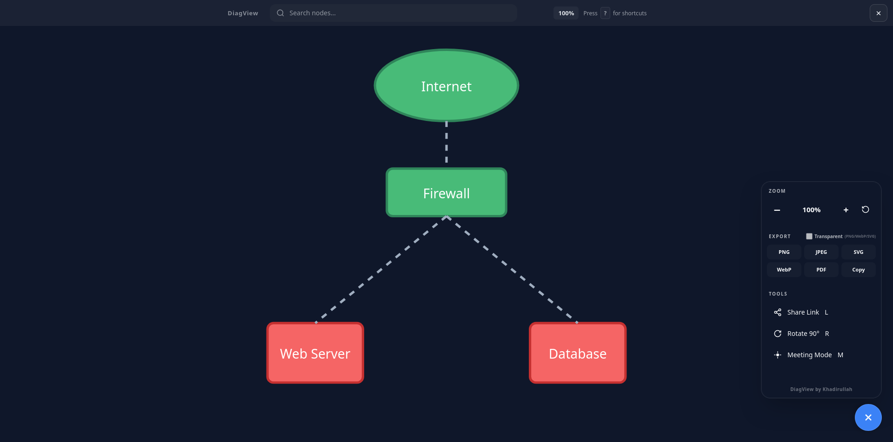
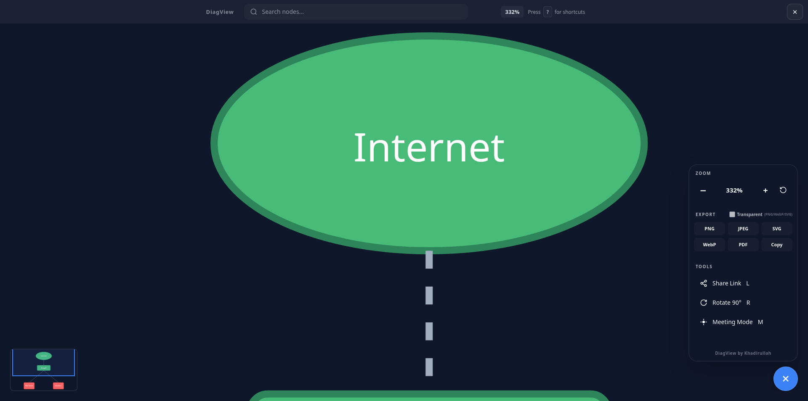
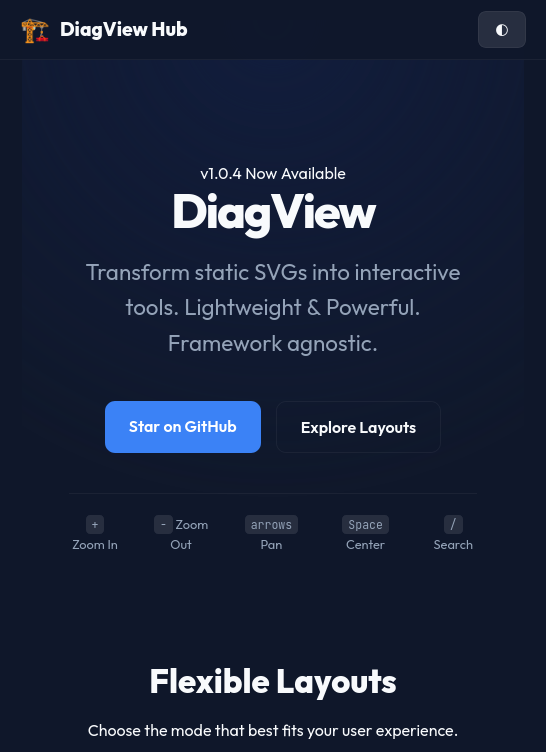

# DiagView

> Lightweight, framework-agnostic interactive diagram viewer with zoom, pan, search, and export.

[](https://www.npmjs.com/package/diagview)
[](https://bundlephobia.com/package/diagview)
[](https://opensource.org/licenses/MIT)

> [!TIP]
> **Check out the Live Demo:** [View Demo Hub](https://khadirullah.github.io/diagview/)

---

## ✨ Features

- 🎨 **Auto-theming** - Detects light/dark mode automatically
- 🔍 **Fast Search** - Highlight nodes with instant search
- 📤 **Multi-format Export** - PNG, SVG, PDF, WebP, Clipboard
- ⌨️ **Keyboard Shortcuts** - Full keyboard navigation
- 📱 **Mobile Optimized** - Touch gestures, pinch-to-zoom, and Viewport Locking for stability
- 🏗️ **Smart Minimap** - Accurate scaling for both portrait and landscape diagrams
- 🎯 **Meeting Mode** - Laser pointer for presentations
- 🔗 **Share Links** - Share exact zoom/pan view
- 🎨 **3 Layout Modes** - Header, Floating, Click-to-open
- 🔄 **Lazy Loading** - Features load on-demand
- 📦 **Minimal Dependencies** - Only requires @panzoom/panzoom
- 🚀 **Framework Agnostic** - Works with React, Vue, Svelte, vanilla JS

---

## 📦 Installation

### CDN (Quickest)
```html
<!-- Panzoom (Required core module) -->
<script src="https://cdn.jsdelivr.net/npm/@panzoom/panzoom@4.5.1/dist/panzoom.min.js"></script>

<!-- DiagramView -->
<script src="https://cdn.jsdelivr.net/npm/diagview@1/dist/diagview.umd.min.js"></script>

<script>
  DiagView.init();
</script>
```

### NPM
```bash
npm install diagview @panzoom/panzoom
```
```javascript
import DiagView from 'diagview';

DiagView.init();
```

---

## 🚀 Quick Start

### 1. Add Your Diagram
```html
<div class="diagram">
  <svg width="800" height="600">
    <!-- Your SVG content -->
  </svg>
</div>
```

### 2. Initialize DiagView
```javascript
DiagView.init({
  layout: 'floating',      // 'header', 'floating', 'off'
  accentColor: '#3b82f6', // Your brand color
  showKeyboardHelp: true   // Show keyboard shortcuts
});
```

### 3. Done! 🎉

DiagView automatically adds:
- ✅ Copy, Download, Fullscreen buttons
- ✅ Zoom/pan in fullscreen mode
- ✅ Search functionality
- ✅ Keyboard shortcuts
- ✅ Export in multiple formats

---

## 📸 Screenshots

### Demo

*Now with intelligent minimap scaling and mobile viewport synchronization.*

### Floating Layout (Default)

*Clean HUD-style buttons that appear on hover. Ideal for minimal UIs.*

### Header Layout

*Classic top-bar controls. Best for documentation and dashboards.*

### Fullscreen Mode

*Professional viewing experience with specialized tools, sidebar search, and high-res export.*

### Smart Minimap

*Intelligent scaling for both portrait and landscape diagrams. Dynamic frame shows exactly what part of the diagram you are viewing.*

### Mobile Optimized

*Responsive hub and viewport locking ensure rock-solid stability even when pinch-zooming.*

---

## 🎨 Layout Modes

### Floating (Modern)
```javascript
DiagView.init({ layout: 'floating' });
```
Buttons overlay at bottom center, appear on hover.

### Header (Classic)
```javascript
DiagView.init({ layout: 'header' });
```
Title bar at top with buttons always visible.

### Off (Minimal)
```javascript
DiagView.init({ layout: 'off' });
```
No buttons, click diagram to open fullscreen.

---

## 📤 Export Formats

- **PNG** - High-resolution raster (configurable DPI)
- **PNG-T** - Transparent background
- **SVG** - Vector format (scalable)
- **WebP / WebP-T** - Modern compressed format (optional transparency)
- **JPEG** - Standard compressed format (no transparency)
- **PDF** - Print-ready document
- **Copy** - Copy to clipboard

### Example:
```javascript
const diagram = document.querySelector('.diagram');
DiagView.exportDiagram(diagram, 'png');
```

---

## ⌨️ Keyboard Shortcuts

| Key | Action |
|-----|--------|
| `Esc` | Close fullscreen |
| `Space` / `0` | Reset zoom |
| `+` / `-` | Zoom in/out |
| `↑↓←→` | Pan diagram |
| `Shift + Arrows` | Fast pan |
| `F` | Focus search |
| `M` | Meeting mode (laser) |
| `L` | Share link |
| `R` | Rotate 90° |
| `?` | Show shortcuts |

---

## 🔍 Search

Instantly highlight nodes in your diagram:

1. Open fullscreen
2. Type in search box (top-left)
3. Matching nodes are highlighted
4. Non-matching nodes are dimmed

Perfect for navigating complex flowcharts and diagrams!

---

## 🎯 Meeting Mode

Laser pointer for presentations:

1. Press `M` in fullscreen
2. Red laser follows your mouse
3. Perfect for virtual meetings

---

## 🔗 Share Links

Share your exact view (zoom + pan):

1. Zoom/pan to desired view
2. Press `L` or click "Share Link"
3. Link copied to clipboard
4. Recipients see exact same view

---

## 🎨 Theming

DiagView auto-detects your theme:
```javascript
// Auto-detect (default)
DiagView.init();

// Manual override
DiagView.init({
  accentColor: '#ff6b6b',
  backgroundColor: '#1a1a1a',
  textColor: '#ffffff',
  showBranding: true
});
```

### CSS Variables Support
```css
:root {
  --diagram-accent: #3b82f6;
  --diagram-text: #1e293b;
  --background: #ffffff;
}
```

---

## ⚙️ Configuration

### Full Options
```javascript
DiagView.init({
  // Theme
  accentColor: null,           // null = auto-detect
  backgroundColor: null,
  textColor: null,

  // Layout
  layout: 'floating',          // 'header', 'floating', 'off'

  // Export
  highResScale: 6,             // 1-10 (desktop)
  mobileScale: 2,              // 1-5 (mobile)

  // Features
  showKeyboardHelp: true,
  rememberZoom: false,         // Remember zoom per diagram
  animateOpen: true,

  // Zoom/Pan
  maxZoomScale: 25,
  minZoomScale: 0.05,

  // Callbacks
  onOpen: () => {},
  onClose: () => {},
  onExport: (format, filename) => {},
  onZoomChange: (scale) => {}
});
```

[See full configuration →](./docs/USAGE.md#advanced-configuration)

---

## 🌐 Framework Integration

### React
```jsx
import { useEffect } from 'react';
import DiagView from 'diagview';

function App() {
  useEffect(() => {
    DiagView.init();
    return () => DiagView.destroy();
  }, []);

  return <div className="diagram"><svg>...</svg></div>;
}
```

### Vue
```vue
<script setup>
import { onMounted, onUnmounted } from 'vue';
import DiagView from 'diagview';

onMounted(() => DiagView.init());
onUnmounted(() => DiagView.destroy());
</script>

<template>
  <div class="diagram"><svg>...</svg></div>
</template>
```

### Svelte
```svelte
<script>
  import { onMount, onDestroy } from 'svelte';
  import DiagView from 'diagview';

  onMount(() => DiagView.init());
  onDestroy(() => DiagView.destroy());
</script>

<div class="diagram"><svg>...</svg></div>
```

[More examples →](./docs/USAGE.md#framework-integration)

---

## 📚 Documentation

- [Usage Guide](./docs/USAGE.md) - Complete guide
- [FAQ](./docs/FAQ.md) - Common questions
- [API Reference](./docs/API.md) - Full API docs
- [Examples](./demo/) - Live demos
  
---

## 🔧 Development
```bash
# Install dependencies
npm install

# Start dev server
npm run dev

# Build library
npm run build

# Check bundle size
npm run size
```

---

## 🤝 Contributing

Contributions welcome! Please read [CONTRIBUTING.md](./CONTRIBUTING.md) first.

1. Fork the repository
2. Create your feature branch (`git checkout -b feature/amazing-feature`)
3. Commit your changes (`git commit -m 'Add amazing feature'`)
4. Push to the branch (`git push origin feature/amazing-feature`)
5. Open a Pull Request

---

## 📝 License

MIT © [Khadirullah Mohammad](https://github.com/khadirullah)

---

## 💡 Why I Built This

I use **Hugo** and **Blowfish** for technical documentation, and while they support **Mermaid.js** beautifully, I found the viewing experience for complex schematics to be limited.

I built **DiagView** to fix that specific frustration—turning static SVGs into an interactive, CAD-like experience. While born from a documentation need, it evolved into a universal wrapper that solves this usability gap for *any* SVG diagram.

---

## 🙏 Credits

- **Panzoom** - Zoom/pan library
- **jsPDF** - PDF export
- **Lucide** - Icon design inspiration

---

## 📊 Browser Support

| Browser | Version |
|---------|---------|
| Chrome | ≥90 |
| Firefox | ≥88 |
| Safari | ≥14 |
| Edge | ≥90 |

**Not supported:** Internet Explorer

---

## ⭐ Show Your Support

Give a ⭐️ if this project helped you!

---

## 📫 Contact

- GitHub: [@khadirullah](https://github.com/khadirullah)
- X (Twitter): [@KhadirullahM](https://x.com/KhadirullahM)
- LinkedIn: [in/khadirullah](https://linkedin.com/in/khadirullah)

---

## 🤖 Authenticity Statement

This library was conceptually designed and specified by the author to solve real-world documentation needs. The implementation was generated using AI assistance under strict human supervision, ensuring the final result meets professional standards for performance, security, and build quality.