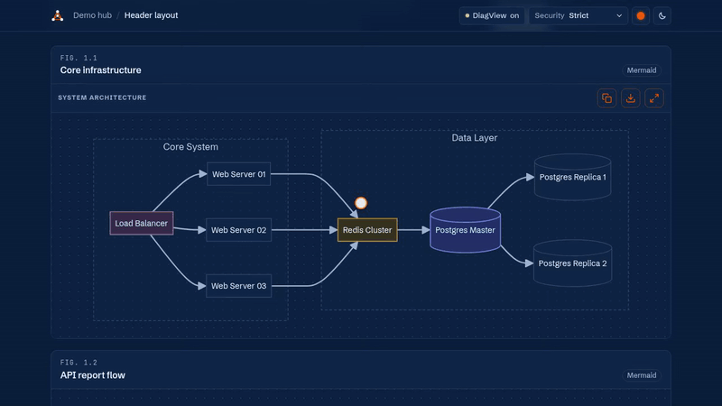
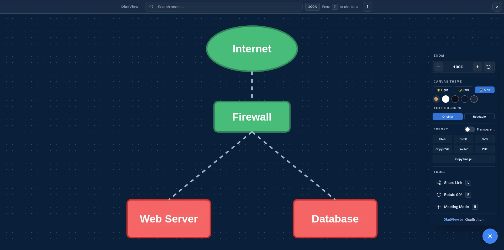
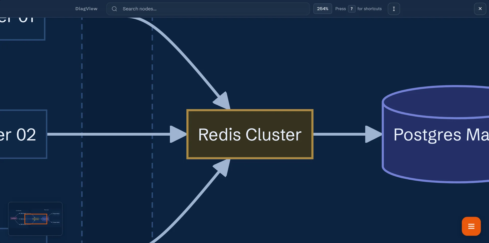
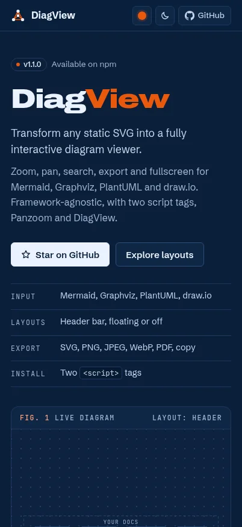
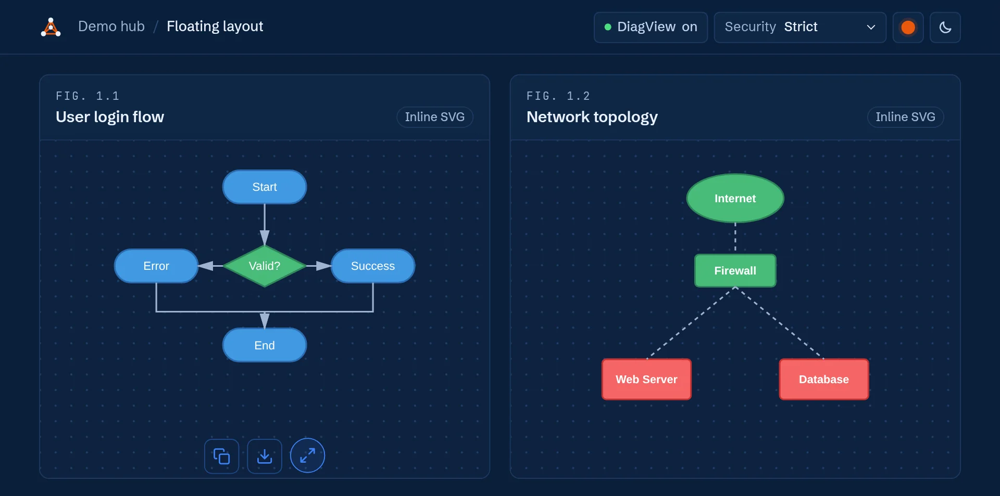
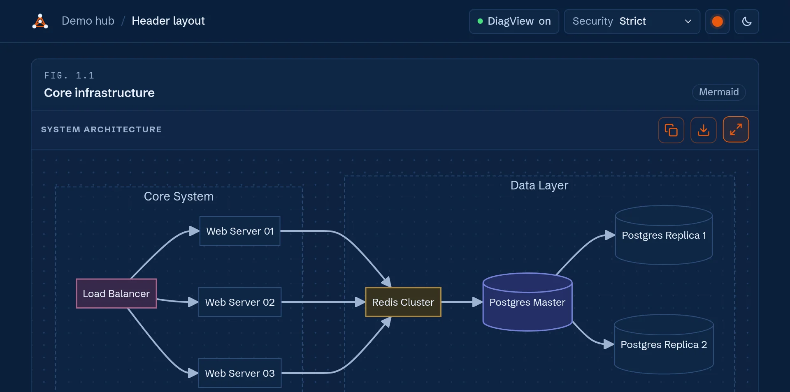
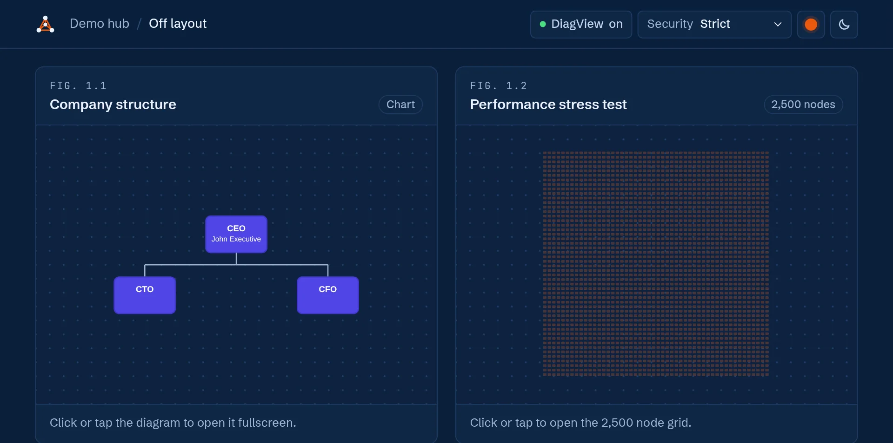

# DiagView

> A lightweight, framework-agnostic interactive viewer for SVG diagrams.  
> Adds Zoom · Pan · Search · Export · Minimap · Rotation · Meeting Mode to any SVG on your page.

[](https://www.npmjs.com/package/diagview)
[](https://bundlephobia.com/package/diagview)
[](https://opensource.org/licenses/MIT)
[](https://github.com/khadirullah/diagview/actions)



> **[Live Demo →](https://khadirullah.github.io/diagview/)** · **[Video Walkthrough (2:31) →](https://www.youtube.com/watch?v=0XemdL7n3ao)**

---

## Table of Contents

- [Features](#-features)
- [Installation](#-installation)
- [Quick Start](#-quick-start)
- [Layout Modes](#-layout-modes)
- [Per-Diagram Overrides](#%EF%B8%8F-per-diagram-overrides)
- [Keyboard Shortcuts](#%EF%B8%8F-keyboard-shortcuts)
- [Export Formats](#-export-formats)
- [Framework Integration](#-framework-integration)
- [Configuration](#%EF%B8%8F-configuration)
- [Live Demo](#-live-demo)
- [Screenshots](#-screenshots)
- [Documentation](#-documentation)
- [Contributing](#-contributing)
- [License](#-license)

---

## ✨ Features

| Feature                      | Description                                                                            |
| ---------------------------- | -------------------------------------------------------------------------------------- |
| 🎨 **Auto-Theming**          | Detects Tailwind, Bootstrap, and system dark/light mode automatically                  |
| 🔍 **Node Search**           | Instant search that outlines matching nodes and fades the rest                         |
| 🖼️ **Canvas Themes**         | Auto, light, dark or custom canvas; Readable mode for faint labels                     |
| 📤 **Multi-Format Export**   | PNG, SVG, PDF, JPEG and WebP, with a transparent background option                     |
| 📋 **Clipboard Copy**        | Copy diagrams directly to the clipboard                                                |
| ⌨️ **Keyboard Shortcuts**    | Full keyboard navigation (zoom, pan, search, share, rotate)                            |
| 📱 **Mobile Optimized**      | Pinch-to-zoom, double-tap to reset, Visual Viewport sync for stability                 |
| 🗺️ **Smart Minimap**         | Accurate portrait/landscape scaling; click-to-navigate                                 |
| 🎯 **Meeting Mode**          | Laser pointer that follows the cursor for presentations                                |
| 🔗 **Precision Share Links** | Share exact zoom/pan position via URL parameters                                       |
| 🔄 **Rotation**              | 90° rotation steps with correct Panzoom recalibration                                  |
| 📝 **Text Select Mode**      | Toggle SVG text selection for copying node labels                                      |
| 🔒 **SVG Sanitization**      | Three-tier security model (strict/permissive/off)                                      |
| 🎭 **3 Layout Modes**        | Header toolbar, buttons that appear on hover, or click-to-open with no inline controls |
| 🔧 **Per-Diagram Overrides** | Set layout, export scale, sanitizing and watermark per diagram via `data-*` attributes |
| 🌐 **Shadow DOM Support**    | Works inside Shadow DOM roots                                                          |
| 🔄 **Remember Zoom**         | Keep zoom, pan and rotation per diagram between opens, until reload                    |
| 📦 **Minimal Dependencies**  | Only requires @panzoom/panzoom core module                                             |
| 🚫 **Framework Agnostic**    | Works with React, Vue, Svelte, Angular, or plain HTML                                  |
| 🏷️ **Silent Branding**       | Off by default. When on, the watermark stamps exports and never shows in the UI        |

---

## 📦 Installation

### CDN (Recommended for quick start)

```html
<!-- 1. Required: Panzoom for zoom/pan physics -->
<script src="https://cdn.jsdelivr.net/npm/@panzoom/panzoom@4.5.1/dist/panzoom.min.js"></script>

<!-- 2. DiagView (latest stable) -->
<script src="https://cdn.jsdelivr.net/npm/diagview@1.1.0/dist/diagview.umd.min.js"></script>
<!-- For auto-updates within v1: use diagview@1 instead -->
```

To disable auto-initialization and configure manually:

```html
<script
  src="https://cdn.jsdelivr.net/npm/diagview@1.1.0/dist/diagview.umd.min.js"
  data-diagview-no-auto-init
></script>
<script>
  DiagView.init({ layout: "floating", accentColor: "#3b82f6" });
</script>
```

Auto-init is deferred by one task, so an `init()` call issued synchronously from a module, `defer` or bundler entry script always wins over it; the attribute is only needed when your `init()` runs later (after an `await`, in a framework effect). It works on any element, usually `<html>` or your script tag.

### npm

```bash
npm install diagview @panzoom/panzoom
```

```javascript
import Panzoom from "@panzoom/panzoom";
import DiagView from "diagview";

window.Panzoom = Panzoom;
DiagView.init({ layout: "floating" });
```

DiagView does not import Panzoom. It reads `window.Panzoom` when the fullscreen viewer opens, so assign it once in your entry file. Without it, the viewer opens with zoom and pan turned off.

CommonJS code and Jest get the same API from `require()`, which resolves `dist/diagview.umd.cjs`. Panzoom still has to be on `window`.

```javascript
const DiagView = require("diagview");
```

### ESM (Bundlers / Vite / Webpack)

```javascript
import Panzoom from "@panzoom/panzoom";
import DiagView from "diagview"; // resolves dist/esm/index.js

window.Panzoom = Panzoom;
```

If your app renders diagrams before it calls `init()`, for example after `await mermaid.run()`, auto-init starts first with default options. Put `data-diagview-no-auto-init` on `<html>` or on your app's script tag to stop it:

```html
<html data-diagview-no-auto-init></html>
```

```javascript
await mermaid.run();
DiagView.init({ layout: "header" }); // your options apply
```

DiagView injects its styles at runtime, so you don't need to import any CSS. The raw stylesheet is also exported for advanced setups (inspecting the rules, building theme overrides, or processing it through your build pipeline):

```javascript
import "diagview/style"; // optional: resolves dist/diagview.css
```

---

## 🚀 Quick Start

### Step 1. Wrap your SVG

DiagView matches any element that contains an `<svg>` tag. By default it targets `.diagram`, `.chart`, and `[data-diagram]`:

```html
<div class="diagram" data-title="System Overview">
  <svg xmlns="http://www.w3.org/2000/svg" viewBox="0 0 800 600">
    <!-- your SVG content -->
  </svg>
</div>
```

### Step 2. Initialize

```javascript
DiagView.init({
  layout: "floating", // 'header' | 'floating' | 'off'
  accentColor: "#3b82f6", // optional brand color
  highResScale: 4, // export resolution (1 to 10)
  showKeyboardHelp: true, // allow the ? shortcuts panel
});
```

### Step 3. Done 🎉

DiagView automatically:

- Wraps each matching diagram with interactive controls
- Adds copy, download, and fullscreen buttons
- Enables zoom, pan, and search in fullscreen mode
- Handles keyboard shortcuts, theme sync, and mobile touch

---

## 🎨 Layout Modes

In every layout, the fullscreen viewer is the same and has a menu button at the bottom right.

### Floating (Default)

The copy, download and fullscreen buttons sit below the diagram, without a title. With a mouse or trackpad they appear on hover or keyboard focus. On touch screens they are always shown.

```javascript
DiagView.init({ layout: "floating" });
```

### Header

A full-width toolbar with the diagram title sits above the diagram. With a mouse or trackpad it appears when the pointer is over the diagram or keyboard focus is inside it. On touch screens it is always shown.

```javascript
DiagView.init({ layout: "header" });
```

### Off (Click-to-open)

DiagView adds no controls to the diagram card. Clicking the diagram itself opens the fullscreen viewer. This suits tight layouts and embeds. `Tab` stops on the diagram too, and `Enter` or `Space` opens the viewer.

```javascript
DiagView.init({ layout: "off" });
```

---

## 🎛️ Per-Diagram Overrides

Any diagram can override the global configuration using `data-diagview-*` attributes. This lets you mix layout modes and export sizes on a single page.

```html
<!-- Use header layout and a larger export for this diagram only -->
<div
  class="diagram"
  data-diagview-layout="header"
  data-diagview-scale="6"
  data-title="My Architecture"
>
  <svg>...</svg>
</div>

<!-- This diagram uses the global defaults -->
<div class="diagram">
  <svg>...</svg>
</div>
```

| Attribute                           | Values                              | Description                                                                         |
| ----------------------------------- | ----------------------------------- | ----------------------------------------------------------------------------------- |
| `data-diagview-layout`              | `header` \| `floating` \| `off`     | Layout for this diagram only                                                        |
| `data-diagview-scale`               | `1` to `10`                         | Export resolution for this diagram only                                             |
| `data-diagview-sanitize`            | `strict` \| `permissive` \| `off`   | SVG sanitization mode                                                               |
| `data-diagview-allow-remote`        | `true` \| `false`                   | Keep remote CSS and fonts under `strict`                                            |
| `data-diagview-watermark`           | `true` \| `false`                   | Turn the watermark on or off for this diagram                                       |
| `data-diagview-watermark-text`      | Any string                          | Custom brand text (e.g. your name)                                                  |
| `data-diagview-watermark-style`     | `corner` \| `background` \| `both`  | Style override for this diagram                                                     |
| `data-diagview-watermark-pos`       | `top-left` \| `...` \| `four-sides` | Position override for this diagram                                                  |
| `data-diagview-watermark-placement` | `diagram` \| `margin`               | Corner and side text on the diagram or in the margin                                |
| `data-diagview-watermark-opacity`   | `0` to `1`                          | Transparency override for this diagram                                              |
| `data-title`                        | Any string                          | Header label, and export file names such as `my_architecture_2026-09-29_101500.png` |

> **Security note:** `data-diagview-sanitize="off"` and `data-diagview-allow-remote="true"` only work when `security.allowOverrides` is `true` in the global config (the default). Use these only with SVGs from fully trusted sources. A diagram's `data-diagview-sanitize` mode also applies to its exports, from the page toolbar and from the fullscreen menu alike. To clean every export and copy in `strict` mode, whatever mode the diagram uses on screen, set `security.exportMode` to `"strict"`. [Choosing a mode](docs/USAGE.md#choosing-a-mode) lists what each mode removes and which one to use.

---

## ⌨️ Keyboard Shortcuts

All shortcuts are active when the fullscreen viewer is open, except while the `?` panel is open. Then only `Esc` and `?` act, and they close it. While the search box or another text field has focus, keys type into the field and only `Esc` acts as a shortcut. With a query in the box, the first `Esc` clears it, the next one leaves the search box, and the one after that closes the viewer. When a button has focus, `Space` and `Enter` press it and the letter keys still work.

| Key                              | Action                                                                  |
| -------------------------------- | ----------------------------------------------------------------------- |
| `Esc`                            | Close help, search or menu, then the viewer                             |
| `Space` / `0`                    | Reset / Fit to screen                                                   |
| `F`                              | Open search                                                             |
| `T`                              | Toggle text select (copy SVG labels)                                    |
| `R`                              | Rotate 90° clockwise                                                    |
| `M`                              | Meeting mode (laser pointer)                                            |
| `L`                              | Copy share link                                                         |
| `+` / `=`                        | Zoom in                                                                 |
| `-` / `_`                        | Zoom out                                                                |
| `↑` `↓` `←` `→`                  | Pan diagram                                                             |
| `Shift`+`Arrows`                 | Fast pan                                                                |
| `?`                              | Show or hide this help                                                  |
| `Ctrl` / `Cmd` / `Alt` + any key | Left to the browser, so its own shortcuts such as `Ctrl`+`F` still work |

`Tab` also stops on links inside the diagram, and `Enter` or `Space` follows the focused link. On the page, `Tab` stops on a diagram with the `off` layout, `Enter` or `Space` opens it, and `Esc` puts focus back on it. A double click on the canvas, or a double tap on a touch screen, resets the view as `0` does. The `?` panel keeps `Tab` inside it, holds back the other shortcuts and gives focus back when it closes. With `showKeyboardHelp: false` the panel is off and the topbar drops its "Press ? for shortcuts" hint. On a phone or tablet with no mouse, the menu's key badges and that hint wait for the first key press, so they show once a keyboard is plugged in. [Keyboard shortcuts](docs/USAGE.md#17-keyboard-shortcuts) in the usage guide has the details.

---

## 📤 Export Formats

| Format     | Transparent | Notes                                                                         |
| ---------- | ----------- | ----------------------------------------------------------------------------- |
| PNG        | ✅          | High-res raster. Default scale is 4, or 2 on touch devices and narrow screens |
| SVG        | ✅          | Fully scalable vector                                                         |
| JPEG       | ❌          | Smallest file size                                                            |
| WebP       | ✅          | Modern format; good compression                                               |
| PDF        | ❌          | Requires jsPDF (lazy-loaded from CDN)                                         |
| Copy Image | ❌          | Copies PNG to system clipboard                                                |
| Copy SVG   | ✅          | Copies the SVG markup to the clipboard as text                                |

Exports embed the page fonts the labels use. Set `exportFonts` to `"all"` to embed every `@font-face` rule, or to `"none"` to embed no fonts. With `"none"`, image and PDF files show the labels in a font installed on your computer. An export made during a search keeps its dimming and outline unless `exportSearchHighlight` is `false`.

PNG, JPEG, WebP, PDF and Copy Image leave out linked images, such as `<image href="logo.png">`. The browser loads nothing that an SVG drawn as an image links to. The file is still saved, and a warning says how many images were left out. When some labels are also hard to read on the background, one warning covers both. SVG exports keep the links. [Linked images](docs/USAGE.md#linked-images) shows how to embed them instead.

### Programmatic export

```javascript
const el = document.querySelector(".diagram");

// Format shortcuts
await DiagView.exportToPNG(el, { transparent: true });
await DiagView.exportToSVG(el);
await DiagView.exportToJPEG(el, { filename: "my-diagram" });
await DiagView.exportToWebP(el, { transparent: true });
await DiagView.exportToPDF(el);
await DiagView.copyToClipboard(el);

// Generic dispatcher (used internally by the UI), resolves to true once the file is saved
const saved = await DiagView.exportDiagram(el, "png", { transparent: true });
```

Pass `silent: true` to skip the linked image and hard-to-read label warnings in every format. For PNG, JPEG, WebP and Copy Image it also skips the progress notice.

---

## 🌐 Framework Integration

Live example: **[React 18 + StrictMode demo](https://khadirullah.github.io/diagview/framework-react.html)** (mount, unmount, remount, replace).

> **One rule for component frameworks (React, Vue, Svelte, Angular):** keep the diagram element nested inside a container that your component renders and owns, as in the examples below. With the `floating` and `header` layouts DiagView moves the diagram element into a wrapper to place the toolbar. Frameworks that later remove that exact element themselves will fail, because it is no longer where they left it. Removing the outer container is always safe. If you would rather DiagView never touch the surrounding DOM, use `layout: "off"`; fullscreen, zoom, search and export still work, only the inline toolbar is dropped.

### React

```jsx
import { useEffect } from "react";
import Panzoom from "@panzoom/panzoom";
import DiagView from "diagview";

window.Panzoom = Panzoom;

export default function App() {
  useEffect(() => {
    DiagView.init({ layout: "floating" });
    return () => {
      DiagView.destroy();
    };
  }, []);

  return (
    <div className="diagram-host">
      <div className="diagram">
        <svg viewBox="0 0 400 300">{/* ... */}</svg>
      </div>
    </div>
  );
}
```

### Vue 3

```vue
<script setup>
import { onMounted, onUnmounted } from "vue";
import Panzoom from "@panzoom/panzoom";
import DiagView from "diagview";

window.Panzoom = Panzoom;

onMounted(() => DiagView.init({ layout: "floating" }));
onUnmounted(() => DiagView.destroy());
</script>

<template>
  <div class="diagram-host">
    <div class="diagram">
      <svg viewBox="0 0 400 300"><!-- ... --></svg>
    </div>
  </div>
</template>
```

### Svelte

```svelte
<script>
  import { onMount, onDestroy } from 'svelte';
  import Panzoom from '@panzoom/panzoom';
  import DiagView from 'diagview';

  window.Panzoom = Panzoom;

  onMount(() => DiagView.init({ layout: 'floating' }));
  onDestroy(() => DiagView.destroy());
</script>

<div class="diagram-host">
  <div class="diagram">
    <svg viewBox="0 0 400 300"><!-- ... --></svg>
  </div>
</div>
```

### Shadow DOM

```javascript
const shadow = myElement.attachShadow({ mode: "open" });
// ... render content into shadow root ...

DiagView.init(); // init normally first
DiagView.initShadowRoot(shadow); // then scan the shadow root
```

The stylesheet is installed inside the shadow root, so the inline toolbar is styled without any extra CSS. Closing the viewer puts focus back on the button or diagram inside the shadow root that opened it.

### Mermaid.js

Always render Mermaid first, then initialize DiagView:

```javascript
await mermaid.run();
DiagView.init({ diagramSelector: ".mermaid" });
```

When the selector matches both a diagram and a wrapper around it, for example `.mermaid, .diagram` with a `.mermaid` inside a `.diagram`, each diagram still gets one toolbar. A wrapper around a single diagram keeps the toolbar, so its `data-title` and `data-diagview-*` settings apply, and the `data-title` names its export files. A wrapper around two or more diagrams gets none, and each inner diagram keeps its own.

---

## ⚙️ Configuration

Full configuration reference:

```javascript
DiagView.init({
  // ── Selectors ────────────────────────────────────
  diagramSelector: ".diagram, .chart, [data-diagram]",

  // ── Theme ────────────────────────────────────────
  accentColor: null, // null = --diagram-accent, then the built-in blue
  warningColor: "#f59e0b", // warning notices
  backgroundColor: null, // null = auto-detect
  textColor: null, // null = auto-detect

  // ── Layout ───────────────────────────────────────
  layout: "floating", // 'header' | 'floating' | 'off'

  // ── UI ───────────────────────────────────────────
  ui: {
    buttons: {
      style: "accent", // 'transparent' | 'accent' | 'solid' | 'neutral', in both header and floating layouts
      icons: {
        copy: null, // null = built-in icon, or an SVG string (use currentColor to follow the button colour)
        download: null,
        fullscreen: null,
      },
    },
  },
  showBranding: true, // Show DiagView branding link
  showKeyboardHelp: true, // Allow the ? shortcuts panel (false disables it and hides the topbar hint)
  showFirstTimeThemeHint: true, // One-time canvas theme tip on first open (stored in localStorage)
  helpTimeout: 8000, // ms before shortcut panel auto-closes (0 = never)
  animateOpen: true, // CSS scale animation when opening fullscreen

  // ── Interaction ──────────────────────────────────
  naturalPanning: false, // true = arrow keys move the diagram in the arrow's direction
  rotateKeepsView: false, // true = rotating keeps the view (same size on screen, same centre)
  rememberZoom: false, // true = restore zoom/pan/rotation on reopen (in memory, until reload)
  showMinimap: true, // Show minimap when diagram overflows viewport
  canvasGrid: "none", // 'none' | 'dots' (dot grid behind the fullscreen diagram)

  // ── Zoom / Pan ───────────────────────────────────
  maxZoomScale: 25, // Upper zoom limit (1 to 50)
  minZoomScale: 0.05, // Lower zoom limit (0.01 to 1)
  zoomAnimationDuration: 200, // ms
  panAnimationDuration: 200, // ms

  // ── Export ───────────────────────────────────────
  highResScale: 4, // Desktop export multiplier (1 to 10)
  mobileScale: 2, // Mobile export multiplier (1 to 5)
  maxPixels: 16777216, // Safety cap (default 16MP = 4096×4096)
  exportSearchHighlight: true, // false = exports during a search skip its dimming and outline
  exportFonts: "used", // 'used' | 'all' | 'none' (page fonts embedded in exports)

  // ── Security ─────────────────────────────────────
  security: {
    mode: "strict", // 'strict' | 'permissive' | 'off'
    allowOverrides: true, // Allow data-diagview-sanitize per element
    allowRemoteResources: false, // true = strict keeps @import and remote url(); permissive and off always keep them
    exportMode: "same", // 'same' | 'strict' ('strict' cleans every export and copy)
  },
  allowedImageTypes: ["png", "jpeg", "webp", "gif"],

  // ── Performance ──────────────────────────────────
  performance: {
    largeFileThreshold: 1000000, // no effect in this version, accepted so old configs still work
    criticalFileLimit: 50000000, // characters of SVG markup; fullscreen and export refuse above this
  },

  // ── Notifications ────────────────────────────────
  toastDuration: 2500, // Success and info toast duration (ms)
  errorToastDuration: 5000, // Error toast duration (ms); warnings always stay 5000

  // ── PDF ──────────────────────────────────────────
  pdfLibraryUrl: "https://cdnjs.cloudflare.com/ajax/libs/jspdf/2.5.1/jspdf.umd.min.js",
  pdfLibraryIntegrity:
    "sha512-qZvrmS2ekKPF2mSznTQsxqPgnpkI4DNTlrdUmTzrDgektczlKNRRhy5X5AAOnx5S09ydFYWWNSfcEqDTTHgtNA==",
  // SRI hash of the default URL. DiagView always pairs that URL with this hash.
  // With a custom pdfLibraryUrl, pass its SRI hash as pdfLibraryIntegrity,
  // otherwise the script loads without an integrity check.

  // ── Callbacks ────────────────────────────────────
  onOpen: null, // () => void, runs after the viewer opens
  onClose: null, // () => void, runs after the viewer closes
  onExport: null, // (format, filename) => void, runs after a successful export
  onZoomChange: null, // (scale) => void, runs when the zoom level changes
  onError: null, // (error) => void, runs when SVG validation fails

  // ── Watermark (Silent Branding) ──────────────────
  watermark: {
    enabled: false, // true = inject branding on export/download
    text: "", // The text to display (e.g. "yourdomain.com")
    style: "corner", // 'corner' | 'background' | 'both'
    position: "bottom-right", // 'top-left' | 'top-right' | 'bottom-left' | 'bottom-right' | 'center' | 'four-sides'
    placement: "diagram", // 'diagram' | 'margin'. Corner and side text on the diagram or in the margin around it
    opacity: 0.2, // 0 to 1 (default 0.2)
  },
});
```

---

## 🚀 Live Demo

Experience all features including Search, Export, and Meeting Mode in our interactive playground:

**[Explore the Live Demo →](https://khadirullah.github.io/diagview/)**

The [2:31 video walkthrough](https://www.youtube.com/watch?v=0XemdL7n3ao) shows every feature, with narration and English subtitles.

---

## 📸 Screenshots

### Fullscreen Viewer

The heart of DiagView. A dedicated, distraction-free environment for deep diagram analysis with integrated tools.


### Smart Minimap

Real-time navigation with accurate portrait/landscape scaling. Click anywhere to jump to that part of the diagram.


### Mobile Optimized

A first-class mobile experience with pinch-to-zoom, double-tap to reset, and visual viewport stability.


### Flexible Layouts

Choose the layout that fits your site: **Floating HUD**, **Header Controls**, or **Minimalist (Off)**.

<p align="center">
  
  
  
</p>

---

## 📚 Documentation

| Document                                             | Description                             |
| ---------------------------------------------------- | --------------------------------------- |
| [Live Demo](https://khadirullah.github.io/diagview/) | **Interactive online playground**       |
| docs/USAGE.md                                        | Complete usage guide (basic → advanced) |
| docs/API.md                                          | Full public API reference               |
| docs/FAQ.md                                          | Frequently asked questions              |
| BUILD.md                                             | Local development & build instructions  |
| CONTRIBUTING.md                                      | How to contribute                       |
| SECURITY.md                                          | Security policy                         |
| CHANGELOG.md                                         | Version history                         |

---

## 🤝 Contributing

Contributions are welcome! See CONTRIBUTING.md for guidelines.

```bash
git clone https://github.com/khadirullah/diagview.git
cd diagview
npm install
npm run dev     # watch mode
npm test        # run unit tests
```

---

## 📝 License

MIT © [Khadirullah Mohammad](https://github.com/khadirullah)

---

## 🙏 Credits

- [Panzoom](https://github.com/timmywil/panzoom) for the zoom and pan physics
- [jsPDF](https://github.com/parallax/jsPDF) for PDF export, loaded on first use
- [Lucide Icons](https://lucide.dev), which inspired the icon design

---

## 🤖 Authenticity Statement

This library was conceptually designed and architected by the author to solve real-world SVG documentation needs. Implementation was produced with AI assistance under strict human supervision and code review.
